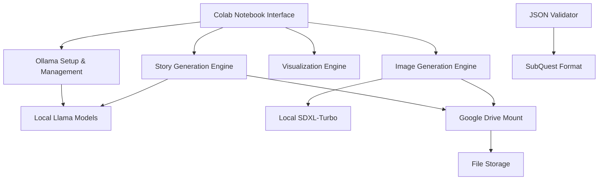

# Design Document

## Overview

The Story Generator is a simplified Google Colab notebook that uses Ollama with Llama models to create high-quality, branching interactive stories for the SubQuest Devvit app. The system focuses on generating meaningful narrative choices using local AI models with GPU acceleration, combined with simple Google Drive integration for file storage.

The design follows a streamlined workflow: Ollama setup → story configuration → contextual story generation → visualization → image generation → Drive storage.

## Architecture

### High-Level Architecture



### Technology Stack

- **Platform**: Google Colab with GPU runtime
- **LLM Service**: Ollama with Llama models (local execution)
- **Image Generation**: Local SDXL-Turbo implementation
- **Cloud Storage**: Google Drive mounting (drive.mount)
- **Visualization**: Existing decision tree visualizer
- **GPU Acceleration**: CUDA support for Ollama and image generation
- **JSON Processing**: Python standard library with basic validation

## Components and Interfaces

### 1. Ollama Setup Manager

**Purpose**: Handles Ollama installation, configuration, and model management

**Key Functions**:
- `install_ollama()`: Downloads and installs Ollama with GPU support
- `configure_gpu()`: Sets OLLAMA_USE_CUDA=1 and verifies GPU access
- `pull_model()`: Downloads specified Llama model (default: llama3.2:1b)
- `test_model()`: Verifies model is working and responsive
- `get_available_models()`: Lists models that can run on current GPU

**Interface**:
```python
class OllamaManager:
    def install_ollama(self) -> bool
    def configure_gpu(self) -> bool
    def pull_model(self, model_name: str = "llama3.2:1b") -> bool
    def test_model(self, model_name: str) -> bool
    def generate_response(self, prompt: str, model_name: str) -> str
```

### 2. Contextual Story Generator

**Purpose**: Uses Ollama to generate meaningful, branching stories with contextual choices

**Key Functions**:
- `generate_story_node()`: Creates a single story node with context-aware content
- `generate_contextual_choices()`: Creates meaningful choices based on current story state
- `build_story_tree()`: Constructs complete branching narrative structure
- `ensure_narrative_coherence()`: Validates that choices lead to different outcomes
- `create_story_endings()`: Generates appropriate conclusions for different paths

**Interface**:
```python
class ContextualStoryGenerator:
    def generate_story_node(self, context: StoryContext, node_id: str) -> StoryNode
    def generate_contextual_choices(self, current_node: StoryNode, story_context: StoryContext) -> List[Choice]
    def build_story_tree(self, story_config: StoryConfig) -> SubQuestJSON
    def ensure_narrative_coherence(self, story: SubQuestJSON) -> ValidationResult
```

### 3. Simple Drive Integration

**Purpose**: Handles Google Drive mounting and file storage with minimal complexity

**Key Functions**:
- `mount_drive()`: Uses Colab's built-in drive.mount('/content/drive')
- `create_project_folder()`: Creates organized folder structure in Drive
- `save_story_files()`: Saves JSON and images to Drive with descriptive names
- `generate_shareable_links()`: Creates accessible URLs for generated content

**Interface**:
```python
class SimpleDriveManager:
    def mount_drive(self) -> bool
    def create_project_folder(self, story_title: str) -> str
    def save_story_files(self, story: SubQuestJSON, images: List[Image], folder_path: str) -> List[str]
    def get_folder_link(self, folder_path: str) -> str
```

### 4. Story Visualization Engine

**Purpose**: Creates visual representations to verify meaningful story branching

**Key Functions**:
- `create_decision_tree()`: Uses existing visualization code to show story structure
- `validate_branching()`: Checks that choices lead to genuinely different paths
- `highlight_choice_diversity()`: Shows how different choices affect the narrative
- `display_story_statistics()`: Provides metrics on story complexity and branching

**Interface**:
```python
class StoryVisualizationEngine:
    def create_decision_tree(self, story: SubQuestJSON) -> DecisionTreeVisualization
    def validate_branching(self, story: SubQuestJSON) -> BranchingReport
    def highlight_choice_diversity(self, story: SubQuestJSON) -> DiversityAnalysis
```

## Data Models

### Core Data Structures

```python
@dataclass
class StoryConfig:
    title: str
    theme: str
    target_rounds: int  # 3-6 rounds recommended
    story_concept: str  # user's initial idea

@dataclass
class StoryContext:
    current_path: List[str]  # sequence of choices made
    theme: str
    characters: List[str]
    setting: str
    plot_points: List[str]

@dataclass
class Choice:
    id: str
    text: str
    nextNodeId: str
    context_impact: str  # how this choice affects the story

@dataclass
class StoryNode:
    id: str
    title: str
    content: str
    imageUrl: str
    choices: List[Choice]
    isEnd: bool = False
    context: StoryContext

@dataclass
class SubQuestJSON:
    title: str
    description: str
    startNodeId: str
    nodes: Dict[str, StoryNode]

@dataclass
class BranchingReport:
    total_nodes: int
    unique_paths: int
    choice_diversity_score: float
    repetitive_choices: List[str]
```

## Error Handling

### Simplified Error Approach

The design prioritizes simplicity over comprehensive error handling:

1. **Ollama Setup Errors**
   - Installation failure: Display error message and suggest manual retry
   - Model download issues: Show progress and basic retry option
   - GPU detection problems: Provide fallback to CPU with performance warning

2. **Story Generation Issues**
   - Poor quality output: Allow regeneration of specific nodes
   - Repetitive choices: Detect and highlight in visualization
   - Broken narrative flow: Basic validation with simple error messages

3. **Drive Integration Problems**
   - Mount failure: Clear instructions for re-mounting
   - Save errors: Basic retry with simple error display

### Minimal Recovery Features

- **Basic Retry**: Simple retry buttons for failed operations
- **Manual Intervention**: Clear instructions for user to resolve issues
- **Graceful Continuation**: Allow skipping problematic steps when possible

## Testing Strategy

### Core Functionality Testing
- Verify Ollama installation and model loading work correctly
- Test story generation produces meaningful, diverse choices
- Validate that generated JSON matches SubQuest format
- Confirm visualization accurately represents story structure

### Quality Assurance
- Manual review of generated stories for narrative coherence
- Verification that choices lead to genuinely different outcomes
- Testing with different Llama model sizes for quality comparison
- Validation that GPU acceleration is properly utilized

## Implementation Considerations

### Ollama Integration
- Install Ollama using curl script: `curl -fsSL https://ollama.com/install.sh | sh`
- Enable GPU support with `OLLAMA_USE_CUDA=1` environment variable
- Start server in background: `nohup ollama serve > /content/ollama.log 2>&1 &`
- Use REST API calls to localhost:11434 for model interaction

### Model Selection Strategy
- Start with llama3.2:1b for fast testing and basic functionality
- Provide options for larger models (3b, 7b) based on GPU memory
- Allow experimentation with different model sizes for quality comparison
- Use consistent prompting strategies optimized for Llama models

### Story Generation Approach
- Use detailed context prompts that include story history and current situation
- Generate choices that explicitly reference current story state
- Implement validation to detect repetitive or generic choice patterns
- Focus on narrative coherence over complex branching structures

### Google Colab Optimization
- Leverage GPU runtime for both Ollama and image generation
- Use simple Drive mounting without complex authentication flows
- Minimize memory usage by loading models only when needed
- Provide clear instructions for users to enable GPU runtime

### Simplified User Experience
- Single notebook with clear cell-by-cell execution
- Minimal configuration options focused on story quality
- Direct feedback through visualization of story structure
- Streamlined workflow without complex checkpoint systems