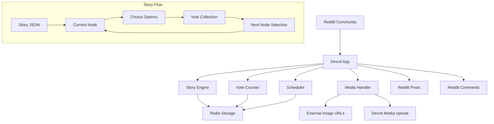

# Design Document

## Overview

SubQuest is a Devvit application that transforms Reddit communities into interactive storytelling platforms. The app leverages Reddit's native posting and voting mechanisms to create a turn-based adventure game where community members collectively choose story paths through upvoting comments. The system automatically progresses the story using Devvit's scheduler functionality and maintains game state through Redis storage.

## Architecture

### High-Level Architecture



### Core Components

1. **Story Engine**: Manages story progression, node traversal, and choice resolution
2. **Vote Counter**: Tracks and analyzes comment upvotes to determine winning choices
3. **Scheduler**: Handles automatic story advancement based on configured intervals
4. **Media Handler**: Fetches external images and rehosts them through Devvit's media API
5. **Redis Manager**: Provides persistent storage for game state and configuration
6. **Settings Interface**: Allows moderators to configure and control the game

## Components and Interfaces

### Story Engine (`/src/utils/storyEngine.ts`)

```typescript
interface StoryNode {
  id: string;
  title: string;
  content: string;
  imageUrl?: string;
  choices?: Choice[];
  isEnd?: boolean;
}

interface Choice {
  id: string;
  text: string;
  nextNodeId: string;
}

interface GameState {
  currentNodeId: string;
  roundNumber: number;
  storyPath: string[];
  isActive: boolean;
  roundStartTime: number;
}

class StoryEngine {
  async loadStory(storyJson: string): Promise<void>
  async getCurrentNode(): Promise<StoryNode>
  async advanceToNode(nodeId: string): Promise<void>
  async getGameState(): Promise<GameState>
  async resetGame(): Promise<void>
}
```

### Vote Counter (`/src/handlers/voteCounter.ts`)

```typescript
interface VoteResult {
  choiceId: string;
  commentId: string;
  upvotes: number;
}

class VoteCounter {
  async trackChoiceComment(choiceId: string, commentId: string): Promise<void>
  async countVotes(): Promise<VoteResult[]>
  async getWinningChoice(): Promise<string>
}
```

### Scheduler Handler (`/src/handlers/scheduler.ts`)

```typescript
class SchedulerHandler {
  async scheduleNextRound(durationHours: number): Promise<void>
  async handleRoundAdvancement(): Promise<void>
  async cancelScheduledRound(): Promise<void>
}
```

### Media Handler (`/src/utils/mediaHandler.ts`)

```typescript
class MediaHandler {
  async fetchAndUploadImage(imageUrl: string): Promise<string>
  async validateImageUrl(url: string): Promise<boolean>
}
```

### Redis Manager (`/src/utils/redisManager.ts`)

```typescript
class RedisManager {
  async setGameState(state: GameState): Promise<void>
  async getGameState(): Promise<GameState | null>
  async setStoryData(story: any): Promise<void>
  async getStoryData(): Promise<any>
  async setConfiguration(config: AppConfig): Promise<void>
  async getConfiguration(): Promise<AppConfig>
}
```

## Data Models

### Story JSON Schema

```json
{
  "title": "Story Title",
  "description": "Story description",
  "startNodeId": "node1",
  "nodes": {
    "node1": {
      "id": "node1",
      "title": "Chapter Title",
      "content": "Story content...",
      "imageUrl": "https://example.com/image.jpg",
      "choices": [
        {
          "id": "choice1",
          "text": "Choice A description",
          "nextNodeId": "node2"
        },
        {
          "id": "choice2",
          "text": "Choice B description", 
          "nextNodeId": "node3"
        }
      ]
    },
    "node2": {
      "id": "node2",
      "title": "Ending Title",
      "content": "Ending content...",
      "isEnd": true
    }
  }
}
```

### Redis Data Structure

```typescript
// Game State Key: "subquest:gamestate"
interface GameState {
  currentNodeId: string;
  roundNumber: number;
  storyPath: string[];
  isActive: boolean;
  roundStartTime: number;
  roundDurationHours: number;
}

// Story Data Key: "subquest:story"
interface StoredStory {
  title: string;
  description: string;
  startNodeId: string;
  nodes: Record<string, StoryNode>;
}

// Vote Tracking Key: "subquest:votes:round{N}"
interface VoteData {
  choices: Record<string, string>; // choiceId -> commentId
  roundEndTime: number;
}

// Configuration Key: "subquest:config"
interface AppConfig {
  roundDurationHours: number;
  isGameActive: boolean;
  subredditName: string;
}
```

## Error Handling

### Error Categories and Responses

1. **Story Loading Errors**
   - Invalid JSON format: Display user-friendly error message to moderator
   - Missing required fields: Validate and highlight specific issues
   - Circular story paths: Detect and prevent infinite loops

2. **Image Processing Errors**
   - Failed image fetch: Continue with text-only post, log error
   - Invalid image format: Skip image, proceed with story content
   - Upload timeout: Retry once, then proceed without image

3. **Redis Connection Errors**
   - Connection failure: Implement exponential backoff retry
   - Data corruption: Reset to safe state with user notification
   - Storage quota exceeded: Clean up old game data automatically

4. **Voting System Errors**
   - Comment creation failure: Retry comment posting
   - Vote counting errors: Use cached vote data as fallback
   - Scheduler failures: Manual advancement option for moderators

### Error Recovery Strategies

```typescript
class ErrorHandler {
  async handleImageError(error: Error, nodeId: string): Promise<void> {
    // Log error, continue without image
    console.error(`Image processing failed for node ${nodeId}:`, error);
    await this.createTextOnlyPost(nodeId);
  }

  async handleRedisError(error: Error, operation: string): Promise<void> {
    // Implement retry logic with exponential backoff
    const maxRetries = 3;
    for (let i = 0; i < maxRetries; i++) {
      try {
        await this.retryOperation(operation);
        break;
      } catch (retryError) {
        if (i === maxRetries - 1) {
          await this.fallbackToLocalStorage(operation);
        }
        await this.delay(Math.pow(2, i) * 1000);
      }
    }
  }
}
```

## Testing Strategy

### Unit Testing Approach

1. **Story Engine Tests**
   - Test story loading and validation
   - Test node traversal logic
   - Test game state management
   - Mock Redis operations for isolated testing

2. **Vote Counter Tests**
   - Test vote aggregation algorithms
   - Test tie-breaking logic
   - Mock Reddit API responses
   - Test edge cases (no votes, equal votes)

3. **Media Handler Tests**
   - Test image URL validation
   - Test upload retry logic
   - Mock external image fetching
   - Test error handling for invalid images

4. **Integration Testing**
   - Test complete story flow from start to end
   - Test scheduler integration with story advancement
   - Test Redis data persistence across app restarts
   - Test moderator settings interface

### Test Data Strategy

```typescript
// Test story data for consistent testing
const TEST_STORY = {
  title: "Test Adventure",
  startNodeId: "start",
  nodes: {
    start: {
      id: "start",
      title: "The Beginning",
      content: "Your adventure begins...",
      choices: [
        { id: "choice1", text: "Go left", nextNodeId: "left" },
        { id: "choice2", text: "Go right", nextNodeId: "right" }
      ]
    },
    left: {
      id: "left",
      title: "The End",
      content: "You chose the left path and found treasure!",
      isEnd: true
    },
    right: {
      id: "right", 
      title: "The End",
      content: "You chose the right path and found adventure!",
      isEnd: true
    }
  }
};
```

### Performance Considerations

1. **Redis Optimization**
   - Use connection pooling for Redis operations
   - Implement data expiration for completed games
   - Batch Redis operations where possible
   - Cache frequently accessed story nodes

2. **Image Processing**
   - Implement image size limits to prevent memory issues
   - Use streaming for large image downloads
   - Cache processed images to avoid re-uploading
   - Implement timeout controls for external requests

3. **Scheduler Efficiency**
   - Use single scheduler instance per subreddit
   - Implement cleanup for expired scheduled tasks
   - Optimize vote counting queries
   - Batch comment operations

### Security Considerations

1. **Input Validation**
   - Sanitize all story JSON input
   - Validate image URLs before fetching
   - Prevent script injection in story content
   - Limit file sizes for uploaded stories

2. **Rate Limiting**
   - Implement cooldowns for game resets
   - Limit story uploads per moderator
   - Throttle image processing requests
   - Prevent spam in choice comments

3. **Access Control**
   - Restrict settings access to moderators only
   - Validate subreddit permissions
   - Secure Redis keys with proper namespacing
   - Log all administrative actions